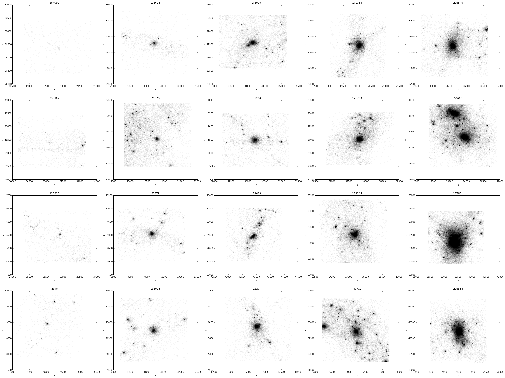

# Index
- [Base Simulation](#markdown-header-base-simulation)
- [Zoom Simulation](#markdown-header-zoom-simulation)
- [Codes](#markdown-header-codes)
- [Simulation parameters](#markdown-header-simulation-parameters)
- [Halo candidates to resimulate](#markdown-header-halo-candidates-to-resimulate)
- [To Do](#markdown-header-to-do)

# Base Simulation

## Base simulation directory
	/data4/lbignone/lgzoom/out512
	
## Initial conditions
Initial conditions parameter files for MUSIC are located at

	/data4/lbignone/lgzoom/512info/ics_512base.conf

## Rockstar halos
	simdir/halos/xx/hlist.txt

where "simdir" is the simulation directory mentioned above and xx is the snapshot number

## FOF halos
	simdir/group_"xxx"/

where "simdir" is the simulation directory mentioned above and xxx is the snapshot number

# Zoom simulations

Zoom simulations are located in
	
	/data4/wmmw/<halo_id>/<zoom level>/
	
If `<halo_id>` starst with a letter "R" the halo id corresponds to a Rockstar halo id, otherwhise is a FOF halo id

The folling information is available in each halo/zoom directory:

- `ics_512_<halo_id>_level<zoom_level>.dat`	MUSIC initial conditions
- `ics_512_<halo_id>_level<zoom_level>.conf`	MUSIC initial condition parameter file
- `ics_512_<halo_id>_level<zoom_level>.conf_log.txt`	MUSIC log file
- `gadget2_<halo_id>_level<zoom_level>.par`	GADGET2 parameter file
- `output_list.txt`	List of times for snapshot outputs
- GADGET2 output files: snapshots, cpu, energy, timings, etc... (only if already computed)

# Codes

Source codes for GADGET, MUSIC and ROCKSTAR can be found in `/data4/lbignone/wmmw/codes` together with some example scripts for compilation in Geryon2
	
# Simulation Parameters

## Cosmological parameters

| Cosmological parameter | Value  |
| ---------------------- | ------ |
| Omega0	             | 0.3175 |
| OmegaLambda		     | 0.6825 |
| OmegaBaryon            |  0.049 |
| h                      | 0.6711 |
| sigma8                 | 0.8288 |
| ns                     | 0.9611 |
| Y                      |  0.248 |

## Softenings for base simulation

|                      | [kcp] |
| -------------------- | ----- |
| SofteningHalo        |   1.5 |
| SofteningHaloMaxPhys |   1.0 |

# Halo candidates for resimulation

A first halo catalogue was compiled from Rockstar halos in the base simulation that satisfy the following criteria:

1. Halo mass in the range [5e9 - 5e12] MSun/h
2. Halo mass is at least 4 time the mass of the most massive neighbour inside the halo virial radius
3. There is no neighouring halo more massive than 1e13 Msun/h in a 1 Mpc/h radius

The halo ids that form this catalogue can be found in 
	
	/data4/lbignone/wmmw/candidates.txt

This initial sample was then distributed in `5` logarithmic mass bins. Each
mass bin was further sorted into bins representing differents ranges of number
of neighbours found inside the virial radius of each halo. The number of
neighbours ranges that where used where:

- N <= 10
- 10 < N <= 20
- 20 < N <= 50
- 50 < N <= 100	

A random sample of 20 halos was constructed as to represent the different categories
of mass and number of neighbours described above. The final list can be found in

	/data4/lbignone/wmmw/selected_halos.txt
	
The file follows the same format as Rockstar ASCII output with the adition of some columns:

- `mass_bin` The correspondig mass bin for the halo [0-4]
- `neighbours[500]` The number of neighbours inside a 500 kpc/h radius
- `neighbours[Rvir]` The number of neighbours inside the virial radius
- `neighbours_bin` The correspondig number of neighbours bin for the halo [0-3]
- `massive_neighbour_d[500]` Distance to the most massive neighbour inside a 500 kpc/h radius. In Mpc/h
- `massive_neighbour_mass[500]` Mass of the most massive neighbour inside a 500 kpc/h radius. In MSun/h
- `massive_neighbour_d[Rvir]` Distance to the most massive neighbour inside the virial radius. In Mpc/h
- `massive_neighbour_mass[Rvir]` Mass of the most massive neighbour inside the virial radius. In MSun/h

For reference an abreviated table is shown bellow

| #ID      | X        | Y        | Z        | M200c           | Mvir            | Np      | Rvir    | neighbours\[500\] | massive_neighbour_d\[500\] | massive_neighbour_mass\[500\] | neighbours\[Rvir\] | massive_neighbour_d\[Rvir\] | massive_neighbour_mass\[Rvir\] |
|----------|----------|----------|----------|-----------------|-----------------|---------|---------|-----------------|--------------------------|-----------------------------|------------------|---------------------------|------------------------------|
| 184999.0 | 19.83838 | 29.40285 | 28.9183  | 6647000000.0    | 7878000000.0    | 135.0   | 40.303  | 1               | 0.29457900858683284      | 1148900000.0                | 0                | 0.0                       | 0.0                          |
| 233107.0 | 31.17134 | 39.4245  | 38.69143 | 5087800000.0    | 5662000000.0    | 83.0    | 36.101  | 0               | 0.0                      | 0.0                         | 0                | 0.0                       | 0.0                          |
| 117322.0 | 25.8253  | 5.46329  | 6.52503  | 33481000000.0   | 37260000000.0   | 489.0   | 67.649  | 1               | 0.39317344226180834      | 5580200000.0                | 0                | 0.0                       | 0.0                          |
| 2848.0   | 9.12347  | 8.89296  | 12.43929 | 35204000000.0   | 39390000000.0   | 577.0   | 68.916  | 3               | 0.33858880799577434      | 1969500000.0                | 0                | 0.0                       | 0.0                          |
| 172676.0 | 30.23518 | 36.7999  | 21.45137 | 129820000000.0  | 150800000000.0  | 2163.0  | 107.798 | 6               | 0.4208530785202827       | 5334000000.0                | 1                | 0.06273622557980131       | 1477100000.0                 |
| 70678.0  | 10.82039 | 26.39407 | 38.36138 | 239950000000.0  | 259000000000.0  | 3283.0  | 129.108 | 6               | 0.1634491147115819       | 4103100000.0                | 1                | 0.10794570672333319       | 3364500000.0                 |
| 32978.0  | 9.62568  | 9.02892  | 34.73824 | 443540000000.0  | 509400000000.0  | 6720.0  | 161.768 | 7               | 0.49979756481999826      | 3610700000.0                | 2                | 0.08309461173866776       | 1805300000.0                 |
| 182073.0 | 31.203   | 26.77412 | 23.41055 | 448380000000.0  | 523600000000.0  | 6599.0  | 163.257 | 11              | 0.08008428247790134      | 6400800000.0                | 7                | 0.08008428247790134       | 6400800000.0                 |
| 172029.0 | 34.15141 | 21.59876 | 20.78378 | 988340000000.0  | 1094000000000.0 | 10942.0 | 208.677 | 19              | 0.10511623376053282      | 145820000000.0              | 11               | 0.10511623376053282       | 145820000000.0               |
| 136214.0 | 30.22618 | 8.4952   | 25.78168 | 581080000000.0  | 761400000000.0  | 9466.0  | 184.952 | 19              | 0.4003944950920279       | 54160000000.0               | 12               | 0.03760708576850872       | 38158000000.0                |
| 158699.0 | 42.90718 | 24.51457 | 6.15137  | 413420000000.0  | 568900000000.0  | 6813.0  | 167.835 | 22              | 0.13062931868458638      | 37830000000.0               | 12               | 0.13062931868458638       | 37830000000.0                |
| 1227.0   | 16.81753 | 5.79321  | 7.1766   | 941320000000.0  | 1060000000000.0 | 13350.0 | 206.493 | 28              | 0.1210818314199111       | 24044000000.0               | 11               | 0.1210818314199111        | 24044000000.0                |
| 171766.0 | 20.02799 | 23.20582 | 18.44313 | 1414100000000.0 | 1667000000000.0 | 20794.0 | 240.167 | 30              | 0.2596265596968076       | 11899000000.0               | 10               | 0.2147206967201823        | 11407000000.0                |
| 171739.0 | 37.83602 | 27.06255 | 21.13517 | 1574200000000.0 | 1781000000000.0 | 19310.0 | 245.506 | 26              | 0.1308433422073901       | 189890000000.0              | 10               | 0.1308433422073901        | 189890000000.0               |
| 158145.0 | 17.62967 | 29.36271 | 6.24698  | 1806400000000.0 | 2107000000000.0 | 24135.0 | 259.657 | 48              | 0.06306724110027323      | 62202000000.0               | 18               | 0.06306724110027323       | 62202000000.0                |
| 60717.0  | 7.20462  | 32.75721 | 35.18716 | 1301200000000.0 | 1578000000000.0 | 19666.0 | 235.797 | 50              | 0.3772588779604834       | 177830000000.0              | 19               | 0.13197034136502162       | 22321000000.0                |
| 228540.0 | 35.64206 | 38.71817 | 29.77349 | 2487800000000.0 | 2877000000000.0 | 33301.0 | 288.066 | 39              | 0.19387939292250872      | 87805000000.0               | 27               | 0.19387939292250872       | 87805000000.0                |
| 50660.0  | 15.89451 | 40.37899 | 19.91348 | 3430100000000.0 | 3976000000000.0 | 47802.0 | 320.878 | 50              | 0.26444268603990523      | 57607000000.0               | 31               | 0.26444268603990523       | 57607000000.0                |
| 157661.0 | 39.4172  | 36.42007 | 12.62284 | 3010400000000.0 | 3277000000000.0 | 49065.0 | 300.869 | 128             | 0.12971018387158578      | 13488000000000.0            | 74               | 0.12971018387158578       | 13488000000000.0             |
| 228338.0 | 24.51139 | 40.2244  | 33.35339 | 3989200000000.0 | 4934000000000.0 | 54312.0 | 344.815 | 92              | 0.3261861129784652       | 100360000000.0              | 68               | 0.3261861129784652        | 100360000000.0               |

Maps of the selected halos are show below

# Number of particles in test IC

| level | halo particles | bndry particles |   total   |
|-------|----------------|-----------------|-----------|
|     9 |      134217728 |               0 | 134217728 |
|    10 |         978120 |       134095463 | 135073583 |
|    11 |        7704576 |       134344787 | 142049363 |

# To Do

- ~~Get access to Geryon from IAFE~~
- ~~Complete R33306 level 10 and 11 simulations~~
- Run FOF and subfind on completed R33306
- Study number distribution of subhalo mass in resimulated halos (also cumulative histogram)
- Prepare initial conditions for all candidates
- Add baryons

